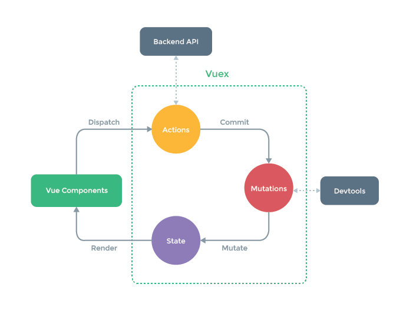

# vue-appetizer
Just for personal workout.

## Basic Note I Have Encounter
#### Difference between export default and export const XXX
- **export default** is that you can import the file with whatever name you like. 
``` js
    // xxx.js
    export default {...}

    //index.js
    import ABC from './xxx'
```
- **export const xxx** is that you may use for export multiple objects with different name. 
```js
    //yyy.js
    export const food = { ...}
    export const drinks = { ...}

    //index.js
    import {food , drinks} from './yyy'
    //or 
    import {food as Menue, drinks as Beverage} from './yyy'
    
```


## Vue Essential Note
- V-models map data to pieces of HTML to allow two-way data binding.

- Computed properties use complex logic to return modified pieces of data. Whenever data changes, it will casue computed property to re-evalute, and trigger assoicated DOM to update.

- Lifecycle hooks like created, mounted, and updated allow vue instances to run specific code throughout its lifespan.

- Props is an array. Data can pass down to the child components.

[Reference from Vue JS 2.0 - Mastering Web Apps by 
David Katz in Udemy]

### Entry Flow
- index.html --> main.js(Vue.js entry point) --> App.vue

## Tools
#### vue-cli (Module System)
- A simple CLI(Command Line Interface) for scaffolding Vue.js projects. Creating Vue project quickly.
- Install
``` bash
$ npm install vue-cli -g
```
- Usage
``` bash
$ vue init <template-name> <project-name>
$ vue init webpack-simple <project-name>
$ vue init webpack my-project
```
- Run webpack web server. 
``` bash
$ npm run dev
```
- Install vue-router
-- save flag will update our package.json. 
``` bash
$ npm install vue-router -- save
```
- Install vuex
-- save flag will update our package.json. 
``` bash
$ npm install vuex -- save
```

## vue-router (Example app : starbase-router)
``` js
    //main.js
    // 0. Import VueRouter and call Vue.use
    Vue.use(VueRouter)

    // 1. Define routes
    // Each route map to one componment
    // Pattern : /data/:type => /data/food, /data/beverage
            //  /data/:type/post/:post_id => /data/food/post/123
    const routes =[
        {path:'/data/:type', componment:Data}
    ]

    // 2. Create the router instance and pass the routes that you have defined
    const router = new VueRouter({
        routes
    })

    // 3. Inside the componement.
    // Use this.$router/this.$route to injecting router
    this.$route.params.type
```

## vuex (Store, Example app : jokester)
- It is a state management pattern library for Vue.js.
- Previous app is using local data in each component. However, when you encounter multiple components share the same state or actions from different components may need to mutate same piece of state, it will be hard to maintain.
- Therefore,it extract share state into one global store for the applicaiton.

#### Store Entry Point
- index.js

#### Flow
- Trigger state change with **commit**. 
(The reason for using commit to change state instead of using store.state.xxx is because this can be more explicitly trace. This convention make debugging more easier.)


#### Three Items in the Vuex Recipe
- **The store** creates the global state object.
- **Mutation** is the only way to change the state.
- **Actions** commit mutations. It call these mutations to actually change the state.